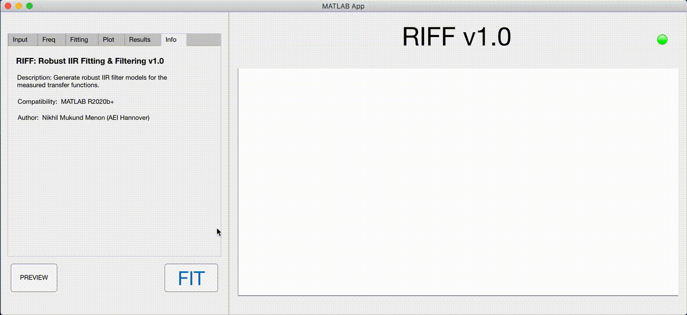

# RIFF: Robust IIR Fitting & Filtering

- Description: Generate robust IIR filter models to match the measured transfer functions.

- Compatibility: MATLAB R2020b+

- To launch the application, open **RIFF.mlapp**

- For command-line use, checkout **fitTF.m**

## Fit a text-file

## Fit workspace variables 

- To use the BADS optimizer, install it from [BADS-GitHub](https://github.com/lacerbi/bads) and add the folder to the search path.
